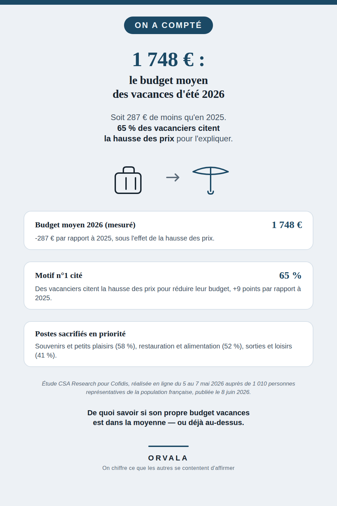

# Combien coûtent des vacances d'été ?

**1 748 €** : c'est le budget moyen que les Français prévoyaient de consacrer à leurs vacances
d'été 2026 — soit **287 € de moins qu'en 2025**.

## La décomposition

| Poste | Chiffre |
|---|---|
| Budget moyen 2026 | **1 748 €** (-287 € vs 2025) |
| Raison n°1 citée pour réduire le budget | **65 %** des vacanciers citent la hausse des prix (+9 points vs 2025) |
| Poste sacrifié en priorité | Souvenirs et petits plaisirs (**58 %**) |
| 2e poste sacrifié | Restauration et alimentation (**52 %**) |
| 3e poste sacrifié | Sorties et loisirs (**41 %**) |

## La source

Étude **CSA Research pour Cofidis**, questionnaire auto-administré en ligne du **5 au 7 mai 2026**,
échantillon de **1 010 personnes** de 18 ans et plus représentatif de la population française
(quotas sexe / âge / profession / région / catégorie d'agglomération), publiée le **8 juin 2026**.

Page source : https://www.cofidis.fr/fr/questions-de-budget/projets-des-francais/vacances-ete-francais-2026.html

Aucun chiffre de ce document n'a été recalculé ou extrapolé : ils sont recopiés tels que publiés
par l'institut.

## Un dispositif existe, mais il dépend de l'employeur

Ce n'est pas une aide automatique comme l'Allocation de Rentrée Scolaire : le **Chèque-Vacances**
n'existe que si l'employeur (ou le comité social et économique) choisit de le proposer.

Quand il existe, la loi plafonne ce que l'employeur peut y verser **sans charges sociales** :
**30 % du Smic brut mensuel, par salarié et par an**, soit **546,92 €** sur la base du Smic en
vigueur au 1ᵉʳ janvier 2026 (1 823,07 € = 12,02 € × 151,67 h). Au-delà de ce plafond, la part
excédentaire est soumise à cotisations sociales.

Ce montant est un **plafond d'exonération**, pas un chiffre versé automatiquement à tout le monde :
il dépend entièrement de la politique de l'entreprise ou du CSE. Il ne se soustrait donc pas du
budget de 1 748 € ci-dessus — les deux ne mesurent pas la même chose (un budget déclaré par les
ménages d'un côté, un plafond légal côté employeur de l'autre).

**Source** : URSSAF, *Prestations du CSE exonérées de cotisations sous conditions* (section
« Chèques vacances »), vérifiée à la source le 14/08/2026 :
https://www.urssaf.fr/accueil/employeur/gerer-entreprise/comite-social-et-economique/prestations-cse-exo-conditions.html

## À propos

Ce dépôt accompagne une épingle Pinterest (compte `orvaladigital`) qui reprend ce chiffre pour le
rendre visible à celles et ceux qui veulent situer leur propre budget vacances par rapport à la
moyenne nationale — pas pour donner un conseil d'économie.

## La série « On a compté »

Toute la série, avec un chiffre-titre par sujet : [github.com/VincentChabran](https://github.com/VincentChabran)

Ce dépôt fait partie d'une série qui chiffre et source ce que les autres se contentent d'affirmer, un sujet à la fois :

- [783 €/an pour un chien, 571 €/an pour un chat](https://github.com/VincentChabran/combien-coute-un-chien-un-chat)
- [19 293 €](https://github.com/VincentChabran/combien-coute-un-mariage)
- [environ 1 239,56 €](https://github.com/VincentChabran/combien-coute-un-demenagement)
- [488 €](https://github.com/VincentChabran/combien-coute-une-rentree-scolaire)
- [491 €](https://github.com/VincentChabran/combien-coute-noel)
- [490 €/mois](https://github.com/VincentChabran/combien-coute-un-bebe)
- [154 € (chez les couples qui la fêtent)](https://github.com/VincentChabran/combien-coute-la-saint-valentin)
- [77 € vs 76 €](https://github.com/VincentChabran/combien-coute-la-fete-des-meres-et-des-peres)
- [85 € (étude 2024)](https://github.com/VincentChabran/combien-coute-halloween)
- [4 730 €](https://github.com/VincentChabran/combien-coute-des-obseques)
- [138 € à 344 €/mois de reste à charge selon le mode (2024)](https://github.com/VincentChabran/combien-coute-la-garde-d-enfant)
